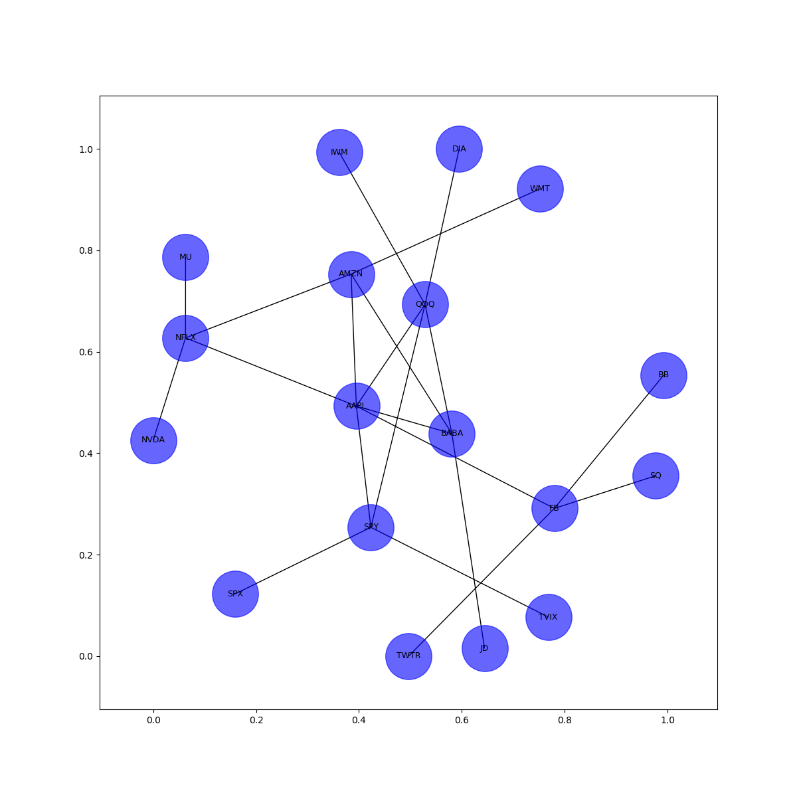

# Stock_Network
Node network visualization of public company mentions on the finance social media site StockTwit

### Dependencies

This script has the following dependencies:
```
Python 3.x
Pandas
Numpy
NetworkX
Matplotlib
```
## Running the Script
Upon running the script you will be given three different prompts:

```
Please enter ticker to look up:
```
This is the stock ticker that will be used as the inital root node in the network. Not case sensitive.

```
Please enter number of sets of 30 tweets to download: (Reccommended 10)
```
The number given to determine the times the API is called for the tweets with the ticker given in the first prompt. Must be a number.

```
Please enter max number of nodes off of the XXXX node:
```
When drawing the network graph the this value is used to determine the max number of other company nodes to connect to the original node. Will have less nodes if not enough other companies show up in the downloaded tweets.

```
Would you like to save API data as a Pandas DataFrame? y/n
```
If y, a file will be created in the local folder of a date/time stamped Pandas dataframe in .pickle format. Has the following structure:
```
|---------------|--------------|---------------|--------------|----------------|
|'stock_id'     |'body'        |'created_at'   |'tweet_id'    |'symbols'       |
|---------------|--------------|---------------|--------------|----------------|
|<str> ticker   |<str> Body of |<str> Date/time|<str>Unique ID|<list>Entries of|
|called to api. |tweet called  |of tweet       |of tweet      |<str>, symbols  |
|               |              |               |              | found in tweet |
|---------------|--------------|---------------|--------------|----------------|
```
Given the following responses to the initial prompt:

```
Please enter ticker to look up: 
AAPL
Please enter number of sets of 30 tweets to download: (Reccommended 10)
10
Please enter max number of nodes off of the AAPL node:
6
Would you like to save API data as a Pandas DataFrame? y/n
y
```

The following graph is generated:


The saved DataFrame pickle and picture file can be found in the files for this Github project. 
